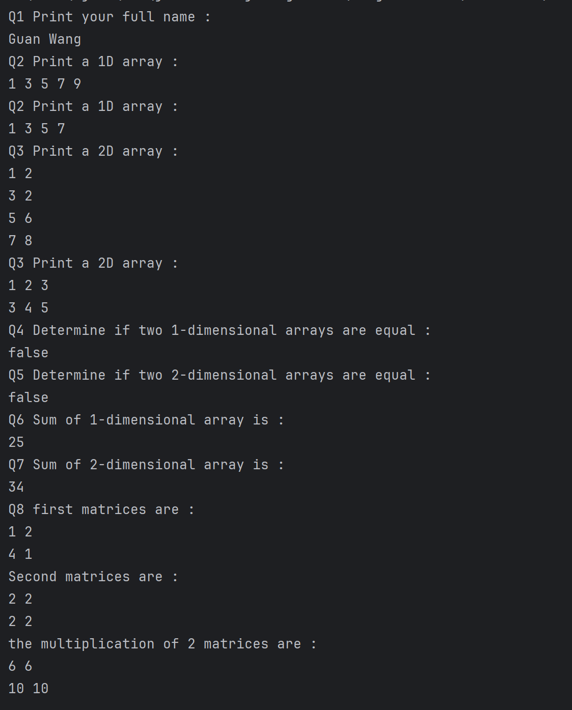

# Cs321_lab2_Guan
# Matrix Operations Java Program

This Java program demonstrates various matrix operations, including printing arrays, checking equality of 1D and 2D arrays, calculating the sum of 1D and 2D arrays, and multiplying two matrices.

## Table of Contents
1. [Print Your Full Name](#print-your-full-name)
2. [Print a 1D Array](#print-a-1d-array)
3. [Print a 2D Array](#print-a-2d-array)
4. [Check 1D Array Equality](#check-1d-array-equality)
5. [Check 2D Array Equality](#check-2d-array-equality)
6. [Sum of 1D Array](#sum-of-1d-array)
7. [Sum of 2D Array](#sum-of-2d-array)
8. [Multiply Two Matrices](#multiply-two-matrices)

## Print Your Full Name
To print your full name, the program uses the `displayName` function.

## Print a 1D Array
The program demonstrates printing a 1D array using the `displayArray` function.

## Print a 2D Array
The `display2DArray` function is used to print a 2D array.

## Check 1D Array Equality
The program checks the equality of two 1D arrays using the `check1DArrayEqual` function.

## Check 2D Array Equality
The equality of two 2D arrays is checked with the `check2DArrayEqual` function.

## Sum of 1D Array
The sum of elements in a 1D array is calculated using the `sum1Darray` function.

## Sum of 2D Array
The sum of elements in a 2D array is calculated using the `sum2Darray` function.

## Multiply Two Matrices
The program multiplies two matrices using the `multipy2Matrices` function. The matrices are checked for compatibility with the `checkMatrix` function.

Feel free to explore the code and run the program to see the results of these matrix operations.

## Result:

